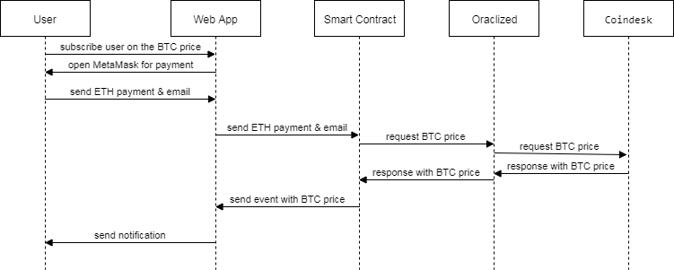

# Smart Contract Bitcoin Rate in a Week

Allows you to get the actual price of bitcoin once a week.
The receipt of the price is ensured by the sending of the postal letter 
To subscribe, you must drop any amount of money into the subscription subscription.



    contract id: 0x275e653b369755a02d1a12528129904e2d8f3c56


Smart Contract Bitcoin push some events:
* updatePrice start update price task
* newBitcoinPrice (Push event Bitcoin Price)
* newBitcoinPriceLess (Push event Bitcoin Price Less than last price)
* newBitcoinPriceEquals (Push event Bitcoin Price Equals than last price)
* newBitcoinPriceMore (Push event Bitcoin Price More than last price)
* newOraclizeQuery (Push event log Oraclize request)
* newBTCPrice (Push event with new price & subscriber)

## Installation & Deploy Smart Contract 

1. Install Truffle globally.
    ```javascript
    npm install -g truffle
 
2. Install npm modules
     ```javascript
     npm install

2. Deploy contract (Default contract deployed into test net Robsten)
    ```javascript
    migrate.sh
 

## Run web app with simple client

1. Run App
     ```javascript
     run.bat

## Test

1. Test contract 
      ```javascript
       test.sh


